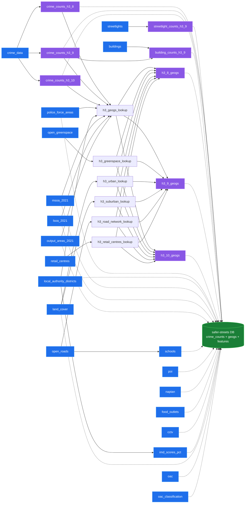

# safer-streets-tooling

Data-build tooling for the safer-streets project. Builds the production DuckDB database
(crime + ONS boundaries + supplementary layers + H3 aggregations) from modular, per-dataset
GeoParquet intermediates. Depends on [`safer-streets-core`](../safer-streets-core) for the database
helpers, H3 transforms, the data-source catalogue, and the ONS boundary downloader.

## Pipeline

Three phases (extract → transform → load), driven by a dataset registry
(`safer_streets_tooling.extract.DATASETS`) and a transform-step registry
(`safer_streets_tooling.transform.STEPS`):

1. **extract** — each dataset is downloaded and preprocessed in its own in-memory DuckDB and dumped to
   a `<name>.parquet` GeoParquet file under `data_dir()/extract` (raw source files are cached under
   `data_dir()/raw`). Extractors run **concurrently** as
   nodes in an `AsyncPipeline`, respecting `depends_on` edges (e.g. `schools` waits for `open_roads`,
   `imd` for `local_authority_districts`). Each parquet is a durable per-dataset cache, so a single
   dataset can be refreshed without rebuilding everything.
2. **transform** — the extracted parquet are loaded into a throwaway in-memory DuckDB, geometry is
   indexed, and the H3 aggregation steps (`safer_streets_tooling.transform.STEPS`) run. The BTP-filtered
   `crime_counts_h3_*` are aggregated from `crime_data`, then every derived relation (those counts, the
   per-cell lookups and `h3_{res}_geogs`) is written out as its own parquet under `data_dir()/transform`
   — a durable cache, so the aggregations can be rebuilt without re-extracting.
3. **load** *(optional)* — a **minimal** consumer database is assembled from the parquet:
   `crime_counts_h3_{res}` and `h3_{res}_geogs` (the per-cell counts + attributes, joined on
   `spatial_id`) plus the ONS boundary tables they reference by code (PFA / LAD / MSOA / LSOA / OA), so a
   consumer can resolve a cell's codes to boundary geometry. It is built in a `<name>.staging.db` and
   atomically promoted over the live database, so consumers only ever see a complete file. **This step is
   optional** — the parquet are the durable build outputs; the database is just a convenience bundle.
   `--include NAME` adds non-default tables (an intermediate `h3_*_lookup` or a feature layer), looked up
   in the transform then extract dirs.

### Extract & transform DAG

In **extract**, every dataset is an `AsyncNode` keyed by its name; `depends_on` are the edges. Nodes
with no incoming edge start immediately and run concurrently (each blocking extractor in a worker
thread); a dependent only starts once its dependencies have produced their parquet. In **transform**
(run during assemble, `safer_streets_tooling.transform`), each step is likewise an `AsyncNode` keyed by
its name with `depends_on` edges: the BTP-filtered `crime_counts_h3_N` are aggregated from `crime_data`;
every H3 cell is keyed off them, then given one ONS code per geography,
the overlapping greenspace / land-cover / road features, and its nearest retail centre — all folded
into `h3_N_geogs`. (For brevity the transform nodes collapse the per-resolution `N ∈ {8,9,10}`; the
geography / overlap / retail lookups all draw their cell set from `crime_counts_h3_N`.)



Each extract node writes `<name>.parquet`; the **transform** phase turns those into the H3 aggregation
parquet. The optional **load** phase then bundles the `crime_counts_h3_*` + `h3_*_geogs` parquet, the
five ONS boundary tables and the `schools` / `poi` / `naptan` / `food_outlets` / `cctv` / `imd_scores_pct` / `land_cover` / `oac` (+ `oac_classification`)
feature layers into a minimal database (dashed above — `--include` can pull in any other table). The
`streetlight_counts` transform step aggregates the `streetlights` extract into a per-cell
`streetlight_counts_h3_9` (count of street lights per resolution-9 cell, keyed by `spatial_id`), which
is included in the default minimal DB (skipped if the optional `streetlights` extract was absent). The
raw `streetlights` point layer itself is **not** bundled by default — this per-cell count is the useful
form (the raw points are millions of rows) — but it can still be pulled in with `--include streetlights`.

Likewise the `building_counts` transform step aggregates the `buildings` extract (Verisk UKBuildings
footprints) into `building_counts_h3_9` — the count of buildings per resolution-9 cell **split by
`map_simple_use`** (Residential / Non Residential / Mixed Use), keyed by `spatial_id`. Each building is
placed by its footprint centroid, and the output is restricted to cells present in `crime_counts_h3_9`
so it lines up with the crime grid (≈83% of all footprints fall in a crime cell). It is bundled in the
default minimal DB (skipped if the optional `buildings` extract was absent); the raw `buildings` layer
(tens of millions of polygons) is **not** bundled by default but can be pulled in with `--include buildings`.

> **OSM coverage caveat (streetlights & cctv).** The `streetlights` layer comes from OpenStreetMap (via
> Overture Maps `infrastructure`, `class = street_lamp`) and `cctv` from OSM `man_made=surveillance`
> (via Overpass). OSM coverage of both is **uneven** — comprehensive in some areas, sparse or absent in
> others — so `streetlights`, `cctv` and the derived `streetlight_counts_h3_9` are best read as a
> **presence/indicative** signal, **not** a complete or authoritative inventory. (For street lights the
> authoritative source is OS NGD `trn-fts-streetlight-1`, which needs a paid/keyed OS Data Hub
> subscription.)

Geometry is British National Grid (EPSG:27700) by convention; the DuckDB GeoParquet writer tags it
`OGC:CRS84`, which is stripped to a bare `GEOMETRY` on load (the coordinates are the contract).

## Usage

```bash
uv sync
uv run data build                       # extract any missing parquet, then transform + load
uv run data extract                     # (re)build only missing parquet intermediates
uv run data extract --only schools      # refresh one dataset (reads open_roads.parquet from cache)
uv run data extract --force-download    # re-fetch every source and rebuild
uv run data transform                   # (re)build the H3 aggregation parquet from the extract parquet
uv run data load                        # (optional) assemble the minimal DB: crime_counts + geogs + boundaries + features
uv run data load --include road_network # …plus any extra table(s) by name
uv run data assemble                    # transform + load in one step
uv run data sync                        # upload the extract + transform parquet to Azure Blob (phase2)
uv run data sync --update newer         # two-way: upload if local newer, download if remote newer
```

To get started quickly, just sync your `SAFER_STREETS_DATA_DIR` with the cloud (credentials needed) and build the db:

```sh
uv run data sync --update newer         # two-way: upload if local newer, download if remote newer
uv run data load
```

`data sync` reconciles every `*.parquet` under `data_dir()/extract` and `data_dir()/transform` with the
`phase2` container, keyed by path relative to `data_dir()` (e.g. `extract/crime_data.parquet`). The
account URL comes from the `SAFER_STREETS_BLOB_STORAGE` env var and authentication uses a service
principal (`AZURE_*` credentials); see `safer_streets_core.file_storage`. A blob absent remotely is
always uploaded; for one that exists on both sides `--update` decides:

- `ignore` *(default)* — upload-only; skip blobs that already exist
- `newer` — **two-way**: upload if the local file is newer, download if the remote blob is newer (and
  pull down blobs that exist only remotely). After each transfer the local mtime is aligned to the
  remote's so repeated runs don't ping-pong.
- `different` — upload-only; overwrite if the md5 sums differ
- `force` — upload-only; always overwrite

## Adding a dataset

1. Write a module under `src/safer_streets_tooling/extract/` exposing a `DATASET = Dataset(...)`
   whose `extract(ctx)` writes `ctx.parquet(name)` (use `_common.write_geoparquet`).
2. Register it in `src/safer_streets_tooling/extract/__init__.py` (after any `depends_on`).
3. `data extract --only <name>` then `data assemble`.

## Adding a transform step

1. Write a module under `src/safer_streets_tooling/transform/` exposing a `STEP = TransformStep(...)`
   with a `build(con, resolutions, replace)`, an `outputs(con, resolutions)` listing the relations it
   produces, and the names of any steps it `depends_on`.
2. Register it in `src/safer_streets_tooling/transform/__init__.py` (after any `depends_on`).
3. `data transform` then `data load` (or `data assemble`).
