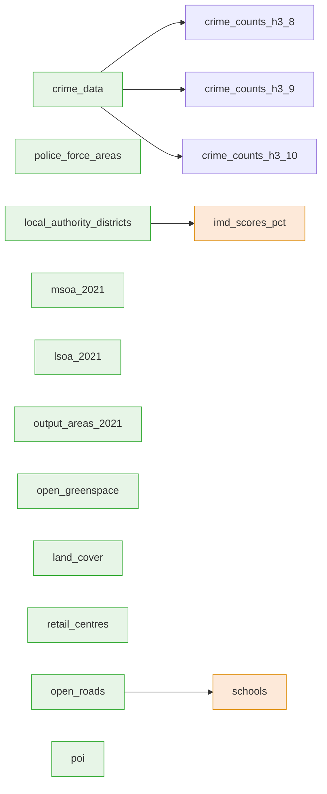

# safer-streets-tooling

Data-build tooling for the safer-streets project. Builds the production DuckDB database
(crime + ONS boundaries + supplementary layers + H3 aggregations) from modular, per-dataset
GeoParquet intermediates. Depends on [`safer-streets-core`](../safer-streets-core) for the database
helpers, H3 transforms, the data-source catalogue, and the ONS boundary downloader.

## Pipeline

Two phases, driven by a dataset registry (`safer_streets_tooling.datasets.DATASETS`):

1. **extract** — each dataset is downloaded and preprocessed in its own in-memory DuckDB and dumped to
   a `<name>.parquet` GeoParquet file under `data_dir()/build`. Extractors run **concurrently** as
   nodes in an `AsyncPipeline`, respecting `depends_on` edges (e.g. `schools` waits for `open_roads`,
   `imd` for `local_authority_districts`). Each parquet is a durable per-dataset cache, so a single
   dataset can be refreshed without rebuilding everything.
2. **assemble** — the present parquet files are imported into a `<name>.staging.db`, geometry tables
   are repaired and RTree-indexed, the H3 transforms run, and the staging file is atomically promoted
   over the live database. Consumers therefore only ever see a complete database.

### Extract DAG

Every dataset is an `AsyncNode` keyed by its name; `depends_on` are the edges. Nodes with no incoming
edge start immediately and run concurrently (each blocking extractor in a worker thread); a dependent
only starts once its dependencies have produced their parquet.



Each node writes `<name>.parquet`, which the **assemble** phase imports.

Geometry is British National Grid (EPSG:27700) by convention; the DuckDB GeoParquet writer tags it
`OGC:CRS84`, which is stripped to a bare `GEOMETRY` on assemble (the coordinates are the contract).

## Usage

```bash
uv sync
data build                       # extract any missing parquet, then assemble
data extract                     # (re)build only missing parquet intermediates
data extract --only schools      # refresh one dataset (reads open_roads.parquet from cache)
data extract --force-download    # re-fetch every source and rebuild
data assemble                    # rebuild the DB from whatever parquet exist
```

## Adding a dataset

1. Write a module under `src/safer_streets_tooling/datasets/` exposing a `DATASET = Dataset(...)`
   whose `extract(ctx)` writes `ctx.parquet(name)` (use `_common.write_geoparquet`).
2. Register it in `src/safer_streets_tooling/datasets/__init__.py` (after any `depends_on`).
3. `data extract --only <name>` then `data assemble`.
