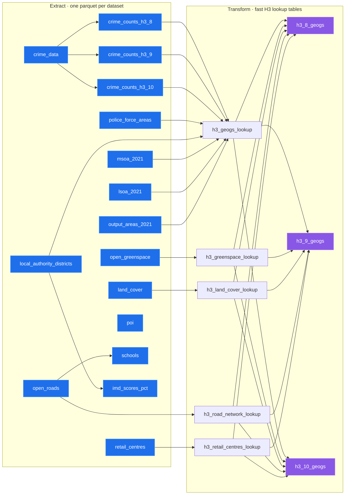

# safer-streets-tooling

Data-build tooling for the safer-streets project. Builds the production DuckDB database
(crime + ONS boundaries + supplementary layers + H3 aggregations) from modular, per-dataset
GeoParquet intermediates. Depends on [`safer-streets-core`](../safer-streets-core) for the database
helpers, H3 transforms, the data-source catalogue, and the ONS boundary downloader.

## Pipeline

Three phases (extract → transform → load), driven by a dataset registry
(`safer_streets_tooling.datasets.DATASETS`):

1. **extract** — each dataset is downloaded and preprocessed in its own in-memory DuckDB and dumped to
   a `<name>.parquet` GeoParquet file under `data_dir()/extract` (raw source files are cached under
   `data_dir()/raw`). Extractors run **concurrently** as
   nodes in an `AsyncPipeline`, respecting `depends_on` edges (e.g. `schools` waits for `open_roads`,
   `imd` for `local_authority_districts`). Each parquet is a durable per-dataset cache, so a single
   dataset can be refreshed without rebuilding everything.
2. **transform** — the extracted parquet are loaded into a throwaway in-memory DuckDB, geometry is
   indexed, and the H3 aggregations (`safer_streets_tooling.transforms`) run. Every derived relation
   (the per-cell lookups and `h3_{res}_geogs`) is written out as its own parquet under
   `data_dir()/transform` — a durable cache, so the aggregations can be rebuilt without re-extracting.
   The already-extracted `crime_counts_h3_*` are kept as-is (their BTP-filtered counts are canonical).
3. **load** — every present parquet (extracted datasets + transform aggregations) is imported into a
   `<name>.staging.db`, geometry tables are repaired and RTree-indexed, and the staging file is
   atomically promoted over the live database. Consumers therefore only ever see a complete database.

### Extract & transform DAG

In **extract**, every dataset is an `AsyncNode` keyed by its name; `depends_on` are the edges. Nodes
with no incoming edge start immediately and run concurrently (each blocking extractor in a worker
thread); a dependent only starts once its dependencies have produced their parquet. In **transform**
(run during assemble, `safer_streets_tooling.transforms`), every H3 cell is keyed off
`crime_counts_h3_N`, then given one ONS code per geography, the overlapping greenspace / land-cover /
road features, and its nearest retail centre — all folded into `h3_N_geogs`. (For brevity the
transform nodes collapse the per-resolution `N ∈ {8,9,10}`; the geography / overlap / retail lookups
all draw their cell set from `crime_counts_h3_N`.)



Each extract node writes `<name>.parquet`; the **transform** phase turns those into the H3
aggregation parquet, and **load** imports both sets into the live database.

Geometry is British National Grid (EPSG:27700) by convention; the DuckDB GeoParquet writer tags it
`OGC:CRS84`, which is stripped to a bare `GEOMETRY` on load (the coordinates are the contract).

## Usage

```bash
uv sync
data build                       # extract any missing parquet, then transform + load
data extract                     # (re)build only missing parquet intermediates
data extract --only schools      # refresh one dataset (reads open_roads.parquet from cache)
data extract --force-download    # re-fetch every source and rebuild
data transform                   # (re)build the H3 aggregation parquet from the extract parquet
data load                        # rebuild the DB from whatever parquet exist (extract + transform)
data assemble                    # transform + load in one step
```

## Adding a dataset

1. Write a module under `src/safer_streets_tooling/datasets/` exposing a `DATASET = Dataset(...)`
   whose `extract(ctx)` writes `ctx.parquet(name)` (use `_common.write_geoparquet`).
2. Register it in `src/safer_streets_tooling/datasets/__init__.py` (after any `depends_on`).
3. `data extract --only <name>` then `data assemble`.
