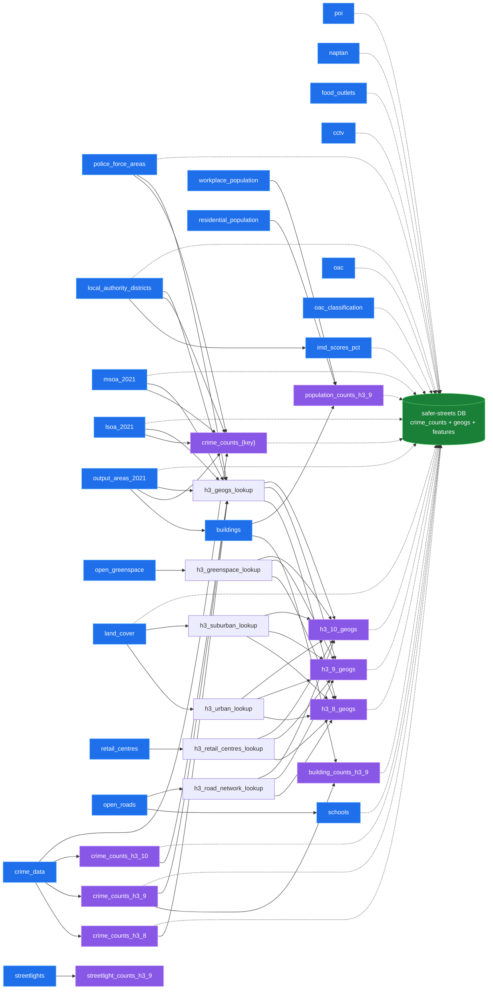

# safer-streets-tooling

Data-build tooling for the safer-streets project. Builds the production GeoParquet outputs
(crime + ONS boundaries + supplementary layers + H3 aggregations) as modular, per-dataset
files — consumers query these directly (in-memory DuckDB, locally or from Azure Blob); an optional
`load` step can also bundle them into a single DuckDB database file. Depends on [`safer-streets-core`](../safer-streets-core) for the database
helpers, H3 transforms, the data-source catalogue, and the ONS boundary downloader.

## Pipeline

Three phases (extract → transform → load), driven by a dataset registry
(`safer_streets_tooling.extract.DATASETS`) and a transform-step registry
(`safer_streets_tooling.transform.STEPS`):

1. **extract** — each dataset is downloaded and preprocessed in its own in-memory DuckDB and dumped to
   a `<name>.parquet` GeoParquet file under `data_dir()/extract` (raw source files are cached under
   `data_dir()/raw`). Extractors run **concurrently** as
   nodes in an `AsyncPipeline`, respecting `depends_on` edges (e.g. `schools` waits for `open_roads`,
   `imd` for `local_authority_districts`). Each parquet is a durable per-dataset cache, so a single
   dataset can be refreshed without rebuilding everything.
2. **transform** — the extracted parquet are loaded into a throwaway in-memory DuckDB, geometry is
   indexed, and the H3 aggregation steps (`safer_streets_tooling.transform.STEPS`) run. The BTP-filtered
   `crime_counts_h3_*` are aggregated from `crime_data` (and `crime_counts_{key}` point-in-polygon per
   ONS geography), then every derived relation (those counts, the
   per-cell lookups and `h3_{res}_geogs`) is written out as its own parquet under `data_dir()/transform`
   — a durable cache, so the aggregations can be rebuilt without re-extracting.
3. **load** *(optional — not currently used)* — a **minimal** consumer database is assembled from the
   parquet: `crime_counts_h3_{res}` and `h3_{res}_geogs` (the per-cell counts + attributes, joined on
   `spatial_id`), the per-ONS-geography `crime_counts_{key}` counts, plus the ONS boundary tables they
   reference by code (PFA / LAD / MSOA / LSOA / OA), so a
   consumer can resolve a cell's codes to boundary geometry. It is built in a `<name>.staging.db` and
   atomically promoted over the live database, so consumers only ever see a complete file. **This step is
   not currently required** — the parquet are the durable build outputs, and consumers query them
   directly (an in-memory DuckDB over the parquet, locally or straight from the Azure blob container
   `data sync` maintains). The database is just a convenience bundle for a consumer that prefers a
   single offline file.
   `--include NAME` adds non-default tables (an intermediate `h3_*_lookup` or a feature layer), looked up
   in the transform then extract dirs.

### Extract & transform DAG

In **extract**, every dataset is an `AsyncNode` keyed by its name; `depends_on` are the edges. Nodes
with no incoming edge start immediately and run concurrently (each blocking extractor in a worker
thread); a dependent only starts once its dependencies have produced their parquet. In **transform**
(run during assemble, `safer_streets_tooling.transform`), each step is likewise an `AsyncNode` keyed by
its name with `depends_on` edges: the BTP-filtered `crime_counts_h3_N` are aggregated from `crime_data`
(and `crime_counts_{key}` point-in-polygon against each ONS boundary table);
every H3 cell is keyed off them, then given one ONS code per geography,
the overlapping greenspace / land-cover / road features, and its nearest retail centre — all folded
into `h3_N_geogs`. (For brevity the transform nodes collapse the per-resolution `N ∈ {8,9,10}`; the
geography / overlap / retail lookups all draw their cell set from `crime_counts_h3_N`.)


```mermaid
flowchart LR
   crime_data
   police_force_areas
   local_authority_districts
   msoa_2021
   lsoa_2021
   output_areas_2021
   open_greenspace
   land_cover
   buildings
   retail_centres
   open_roads
   poi
   naptan
   food_outlets
   streetlights
   cctv
   schools
   imd_scores_pct
   oac
   oac_classification
   workplace_population
   residential_population

   crime_counts_h3_8
   crime_counts_h3_9
   crime_counts_h3_10
   crime_counts_geog["crime_counts_{key}"]
   streetlight_counts_h3_9
   building_counts_h3_9
   population_counts_h3_9
   h3_geogs_lookup
   h3_greenspace_lookup
   h3_urban_lookup
   h3_suburban_lookup
   h3_road_network_lookup
   h3_retail_centres_lookup
   h3_8_geogs
   h3_9_geogs
   h3_10_geogs

   direction LR
   database[("safer-streets DB<br/>crime_counts + geogs + features")]

    %% extract edges
    open_roads --> schools
    local_authority_districts --> imd_scores_pct
    output_areas_2021 --> buildings

    %% transform edges
    crime_data --> crime_counts_h3_8
    crime_data --> crime_counts_h3_9
    crime_data --> crime_counts_h3_10
    crime_data --> crime_counts_geog
    police_force_areas --> crime_counts_geog
    local_authority_districts --> crime_counts_geog
    msoa_2021 --> crime_counts_geog
    lsoa_2021 --> crime_counts_geog
    output_areas_2021 --> crime_counts_geog
    streetlights --> streetlight_counts_h3_9
    buildings --> building_counts_h3_9
    crime_counts_h3_9 --> building_counts_h3_9
    buildings --> population_counts_h3_9
    workplace_population --> population_counts_h3_9
    residential_population --> population_counts_h3_9
    crime_counts_h3_8 --> h3_geogs_lookup
    crime_counts_h3_9 --> h3_geogs_lookup
    crime_counts_h3_10 --> h3_geogs_lookup
    police_force_areas --> h3_geogs_lookup
    local_authority_districts --> h3_geogs_lookup
    msoa_2021 --> h3_geogs_lookup
    lsoa_2021 --> h3_geogs_lookup
    output_areas_2021 --> h3_geogs_lookup
    open_greenspace --> h3_greenspace_lookup
    land_cover --> h3_urban_lookup
    land_cover --> h3_suburban_lookup
    open_roads --> h3_road_network_lookup
    retail_centres --> h3_retail_centres_lookup
    h3_geogs_lookup --> h3_8_geogs
    h3_greenspace_lookup --> h3_8_geogs
    h3_urban_lookup --> h3_8_geogs
    h3_suburban_lookup --> h3_8_geogs
    h3_road_network_lookup --> h3_8_geogs
    h3_retail_centres_lookup --> h3_8_geogs
    h3_geogs_lookup --> h3_9_geogs
    h3_greenspace_lookup --> h3_9_geogs
    h3_urban_lookup --> h3_9_geogs
    h3_suburban_lookup --> h3_9_geogs
    h3_road_network_lookup --> h3_9_geogs
    h3_retail_centres_lookup --> h3_9_geogs
    h3_geogs_lookup --> h3_10_geogs
    h3_greenspace_lookup --> h3_10_geogs
    h3_urban_lookup --> h3_10_geogs
    h3_suburban_lookup --> h3_10_geogs
    h3_road_network_lookup --> h3_10_geogs
    h3_retail_centres_lookup --> h3_10_geogs

    %% load edges (optional): minimal DB = crime counts + geogs + ONS boundary tables + feature layers; --include adds more
    crime_counts_h3_8 -.-> database
    crime_counts_h3_9 -.-> database
    crime_counts_h3_10 -.-> database
    crime_counts_geog -.-> database
    building_counts_h3_9 -.-> database
    population_counts_h3_9 -.-> database
    h3_8_geogs -.-> database
    h3_9_geogs -.-> database
    h3_10_geogs -.-> database
    police_force_areas -.-> database
    local_authority_districts -.-> database
    msoa_2021 -.-> database
    lsoa_2021 -.-> database
    output_areas_2021 -.-> database
    schools -.-> database
    poi -.-> database
    naptan -.-> database
    food_outlets -.-> database
    cctv -.-> database
    imd_scores_pct -.-> database
    land_cover -.-> database
    oac -.-> database
    oac_classification -.-> database

    %% colour by phase, tuned for dark backgrounds (white text on saturated fills, light strokes)
    classDef extract fill:#1f6feb,stroke:#79c0ff,stroke-width:1px,color:#ffffff;
    classDef transform fill:#8957e5,stroke:#d2a8ff,stroke-width:1px,color:#ffffff;
    classDef load fill:#1a7f37,stroke:#56d364,stroke-width:1px,color:#ffffff;
    class crime_data,police_force_areas,local_authority_districts,msoa_2021,lsoa_2021,output_areas_2021,open_greenspace,land_cover,buildings,retail_centres,open_roads,poi,naptan,food_outlets,streetlights,cctv,schools,imd_scores_pct,oac,oac_classification,workplace_population,residential_population extract;
    class crime_counts_h3_8,crime_counts_h3_9,crime_counts_h3_10,crime_counts_geog,streetlight_counts_h3_9,building_counts_h3_9,population_counts_h3_9,h3_8_geogs,h3_9_geogs,h3_10_geogs transform;
    class database load;
```

Each extract node writes `<name>.parquet`; the **transform** phase turns those into the H3 aggregation
parquet. The optional **load** phase (not currently used) then bundles the `crime_counts_h3_*` + `crime_counts_{key}` +
`h3_*_geogs` parquet, the
five ONS boundary tables and the `schools` / `poi` / `naptan` / `food_outlets` / `cctv` / `imd_scores_pct` / `land_cover` / `oac` (+ `oac_classification`)
feature layers into a minimal database (dashed above — `--include` can pull in any other table). The
`streetlight_counts` transform step aggregates the `streetlights` extract into a per-cell
`streetlight_counts_h3_9` (count of street lights per resolution-9 cell, keyed by `spatial_id`); neither
it nor the raw `streetlights` point layer is bundled by default — pull them in with
`--include streetlight_counts_h3_9` (or `--include streetlights` for the raw points, millions of rows).

The `buildings` extract itself spatially joins each footprint to the 2021 output areas, tagging it with
`oa21cd` (the OA21 code) of the OA containing its **centroid** (a LEFT join, so a footprint whose
centroid falls outside every OA — e.g. Scotland or offshore structures — is kept with a null
`oa21cd` rather than dropped). The same centroid is also indexed to a resolution-9 H3 cell `h3_9_id`
(lowercase hex), so the raw layer can be joined straight onto the crime grid / `h3_9_geogs`. Alongside
the premise/use classification each footprint carries its size: `premise_floor_count` (number of floors;
kept verbatim as text since a premise whose floor count varies across its footprint carries a comma-list,
e.g. `"1,2"`), `premise_area` (footprint area, m²) and `gross_area` (total floor area, m² — footprint ×
floors where known).

Likewise the `building_counts` transform step aggregates the `buildings` extract (Verisk UKBuildings
footprints) into `building_counts_h3_9` — the count of buildings per resolution-9 cell **split by
`map_simple_use`** (Residential / Non Residential / Mixed Use), keyed by `spatial_id`. Each building is
placed by its footprint centroid, and the output is restricted to cells present in `crime_counts_h3_9`
so it lines up with the crime grid (≈83% of all footprints fall in a crime cell). It is bundled in the
default minimal DB (skipped if the optional `buildings` extract was absent); the raw `buildings` layer
(tens of millions of polygons) is **not** bundled by default but can be pulled in with `--include buildings`.

Two attribute-only extracts hold the Census 2021 populations per 2021 output area, both keyed by
`spatial_id` (the OA21 code). `workplace_population` is the **WP001** count (nomis bulk download): the
workplace population is an estimate of the usually resident population aged 16 years and over, working
in an area. It includes people who work mainly at or from home, or do not have a fixed place of work,
in their area of usual residence. `residential_population` is the **TS001** count of usual residents
(nomis API, table `NM_2021_1`; needs a free `NOMIS_API_KEY`), split by residence type into
`household_population` and `communal_population`. A usual resident is anyone who, on Census Day
(21 March 2021), was in the UK and had stayed or intended to stay in the UK for a period of 12 months
or more, or had a permanent UK address and was outside the UK and intended to be outside the UK for
less than 12 months.

The `population_counts` transform step disaggregates both onto the crime grid as
`population_counts_h3_9` (one row per res-9 cell: `spatial_id`, `residential_population`,
`workplace_population`). Each OA's populations are first assigned to that OA's buildings pro rata to
total floor area (`gross_area`, falling back to the footprint `premise_area` where the floor count is
unknown) times a use weight — the workplace population to **Non Residential** (×1.0) and **Mixed Use**
(×0.5) buildings, the residential population (households + communal establishments) to **Residential**
(×1.0) and **Mixed Use** (×0.5), i.e. a mixed-use building sits 50-50 in both pools — then the
per-building assignments are grouped by the building's `h3_9_id` and summed. Both populations are
conserved onto the grid except where they cannot be assigned (an OA with no building of the right
type, or a building whose centroid falls in no OA); the step reports the allocated share of each
source total. It is bundled in the default minimal DB (skipped if any of its three input extracts was
absent).

> **TODO:** now that the `buildings` extract carries `h3_9_id` per footprint, `building_counts_h3_9` may
> be surplus to requirements — a consumer can aggregate the counts directly from `buildings` by
> `h3_9_id` / `map_simple_use`. Consider dropping the transform (and its bundled table) once nothing
> depends on the pre-aggregated form.

OSM coverage of the `streetlights` and `cctv` layers is uneven — see
[Data-quality caveats](#data-quality-caveats) below.

Geometry is British National Grid (EPSG:27700) by convention; the DuckDB GeoParquet writer tags it
`OGC:CRS84`, which is stripped to a bare `GEOMETRY` on load (the coordinates are the contract).

## Datasets

One module per dataset under [src/safer_streets_tooling/extract/](src/safer_streets_tooling/extract/),
each exposing a `DATASET` (or `DATASETS` for the boundary group). Required datasets abort the build if
they can't be produced; optional ones are best-effort and skipped (the H3 transforms tolerate their
absence). Registry order respects `depends_on`:

| Dataset(s) | Module | Required? | Depends on |
| ---------- | ------ | --------- | ---------- |
| `crime_data` | [crime.py](src/safer_streets_tooling/extract/crime.py) | yes | — |
| 5 ONS boundary tables | [boundaries.py](src/safer_streets_tooling/extract/boundaries.py) | yes | — |
| `open_greenspace` | [greenspace.py](src/safer_streets_tooling/extract/greenspace.py) | no | — |
| `land_cover` | [land_cover.py](src/safer_streets_tooling/extract/land_cover.py) | no | — |
| `buildings` | [buildings.py](src/safer_streets_tooling/extract/buildings.py) | no | `output_areas_2021` (OA `oa21cd` for each footprint) |
| `retail_centres` | [retail_centres.py](src/safer_streets_tooling/extract/retail_centres.py) | no | — |
| `open_roads` | [roads.py](src/safer_streets_tooling/extract/roads.py) | no | — |
| `poi` | [poi.py](src/safer_streets_tooling/extract/poi.py) | no | — |
| `naptan` | [naptan.py](src/safer_streets_tooling/extract/naptan.py) | no | — |
| `food_outlets` | [food_outlets.py](src/safer_streets_tooling/extract/food_outlets.py) | no | — |
| `streetlights` | [streetlights.py](src/safer_streets_tooling/extract/streetlights.py) | no | — |
| `cctv` | [cctv.py](src/safer_streets_tooling/extract/cctv.py) | no | — |
| `schools` | [schools.py](src/safer_streets_tooling/extract/schools.py) | no | `open_roads` (walk-isochrone network) |
| `imd_scores_pct` | [imd.py](src/safer_streets_tooling/extract/imd.py) | no | `local_authority_districts` (Welsh LA-name→code lookup) |
| `oac`, `oac_classification` | [oac.py](src/safer_streets_tooling/extract/oac.py) | no | — |
| `workplace_population` | [workplace_population.py](src/safer_streets_tooling/extract/workplace_population.py) | no | — |
| `residential_population` | [residential_population.py](src/safer_streets_tooling/extract/residential_population.py) | no | — |

## Data-quality caveats

### OSM coverage: `streetlights` & `cctv`

Both layers are sourced from OpenStreetMap and inherit its uneven, volunteer-driven coverage:

- **`streetlights`** — Overture Maps `base/infrastructure`, `subtype = transportation` /
  `class = street_lamp` (OSM `highway=street_lamp`), streamed from S3.
- **`cctv`** — OSM `man_made=surveillance` nodes, via the Overpass API.

OSM tagging of street furniture is **comprehensive in some areas and sparse or entirely absent in
others** — coverage tends to arrive via occasional bulk imports (a council's asset inventory, a local
mapping party) rather than organic, nationwide surveying. So `streetlights`, `cctv` and the derived
`streetlight_counts_h3_9` are best read as a **presence / indicative** signal, **not** a complete or
authoritative inventory.

Concretely, the England & Wales `streetlights` extract holds ~129k lamps spread across only ~13.7k
distinct resolution-9 cells (out of ~1.4M land cells), heavily clustered in a handful of well-mapped
areas. Most cells report zero not because they are unlit but because nobody has tagged their lighting.
This was checked against the raw Overture release — the extract row count matches Overture exactly, and
the BNG reprojection and H3-cell assignment are both correct — so the sparsity is a **source-data
limitation, not a pipeline bug**.

**Authoritative alternative (OS).** For a complete national inventory the authoritative source is
Ordnance Survey — the OS NGD street-lighting collection (`trn-fts-streetlight-1`, Transport theme /
street furniture), which requires a keyed OS Data Hub / NGD API subscription. We should switch
`streetlights` over to the OS dataset **once (a) it can be located and accessed under our OS licence
and (b) that licence permits us to publish the aggregate `streetlight_counts_h3_9` we derive from it**
(per-cell counts, not the raw point locations). Until then the OSM/Overture layer stands as an
indicative placeholder. The same OS caveat applies to `cctv`, for which there is no comparable
authoritative national feed — it remains indicative only.

## Transform steps

One module per step under [src/safer_streets_tooling/transform/](src/safer_streets_tooling/transform/),
each exposing a `STEP`. Each step writes the relations it produces out as parquet under
`data_dir()/transform`; a step whose outputs already exist is skipped unless `--all`. Registry order
respects `depends_on`:

| Step | Module | Outputs | Depends on |
| ---- | ------ | ------- | ---------- |
| `crime_counts` | [crime_counts.py](src/safer_streets_tooling/transform/crime_counts.py) | `crime_counts_h3_{res}`, `crime_counts_{key}` (per ONS geography) | — |
| `streetlight_counts` | [streetlight_counts.py](src/safer_streets_tooling/transform/streetlight_counts.py) | `streetlight_counts_h3_9` | — |
| `building_counts` | [building_counts.py](src/safer_streets_tooling/transform/building_counts.py) | `building_counts_h3_9` (by `map_simple_use`) | `crime_counts` |
| `population_counts` | [population_counts.py](src/safer_streets_tooling/transform/population_counts.py) | `population_counts_h3_9` | — |
| `geo_lookups` | [geo_lookups.py](src/safer_streets_tooling/transform/geo_lookups.py) | `h3_{res}_{key}_lookup` | `crime_counts` |
| `overlap_lookups` | [overlap_lookups.py](src/safer_streets_tooling/transform/overlap_lookups.py) | `h3_{res}_{name}_lookup` | `crime_counts` |
| `retail_centre_lookups` | [retail_centre_lookups.py](src/safer_streets_tooling/transform/retail_centre_lookups.py) | `h3_{res}_retail_centre_lookup` | `crime_counts` |
| `geogs` | [geogs.py](src/safer_streets_tooling/transform/geogs.py) | `h3_{res}_geogs` | `geo_lookups`, `overlap_lookups`, `retail_centre_lookups` |

## Table catalogue (`index.parquet`)

Every command that (re)builds parquet (`extract` / `transform` / `assemble` / `build`) rewrites
`data_dir()/index.parquet` (also available standalone as `data index`): one row per parquet
under `extract/` and `transform/`, with its `phase`, `name`, a one-line `description`, its
`n_rows` / `n_columns` / `columns` schema summary, a `has_geometry` flag and `last_modified` — the
parquet's mtime (UTC), i.e. when the table was last built (`sync` preserves it across machines). The
descriptions come from
the registries — `Dataset.description` (extract) and `TransformStep.description` (transform) — which are
**required** (validated at import), so every table in the catalogue is described. Keep those fields
current when a table changes and the catalogue follows.

## Key modules

Source lives in [src/safer_streets_tooling/](src/safer_streets_tooling/):

| File | Role |
| ---- | ---- |
| [data_pipeline.py](src/safer_streets_tooling/data_pipeline.py) | `data` CLI: `extract` / `transform` / `load` / `assemble` / `build` / `index` / `sync` commands |
| [index.py](src/safer_streets_tooling/index.py) | `build_index`: writes `index.parquet` cataloguing every extract + transform table (name, description, schema) |
| [extract/pipeline.py](src/safer_streets_tooling/extract/pipeline.py) | Concurrent extract phase: `DatasetExtractNode`, `build_pipeline`, `run_extract` |
| [transform/pipeline.py](src/safer_streets_tooling/transform/pipeline.py) | Concurrent transform phase: `TransformNode`, `build_pipeline`, `build_all` |
| [async_pipeline.py](src/safer_streets_tooling/async_pipeline.py) | DAG runner over `AsyncNode`s (`graphlib.TopologicalSorter` + `asyncio.gather`) |
| [async_node.py](src/safer_streets_tooling/async_node.py) | `AsyncNode` base: derives `dependency_ids` from `execute`'s kwonly args; `__call__` captures exceptions as `Err` |
| [result.py](src/safer_streets_tooling/result.py) | `Result[T]` / `Ok` / `Err` (`unwrap`, `is_ok`, `is_err`) |
| [extract/base.py](src/safer_streets_tooling/extract/base.py) | `Dataset` spec + `ExtractContext` |
| [extract/__init__.py](src/safer_streets_tooling/extract/__init__.py) | Ordered `DATASETS` registry + `BY_NAME` + dependency validation |
| [extract/_common.py](src/safer_streets_tooling/extract/_common.py) | `download`, `extract_cached`, `rename_geom_column`, `write_geoparquet`, `read_geoparquet` |
| [transform/base.py](src/safer_streets_tooling/transform/base.py) | `TransformStep` spec + `create_clause` / `table_exists` helpers |
| [transform/__init__.py](src/safer_streets_tooling/transform/__init__.py) | Ordered `STEPS` registry + `BY_NAME` + dependency validation |

## Usage

```bash
uv sync
uv run data build                       # extract any missing parquet, then transform + load
uv run data extract                     # (re)build only missing parquet intermediates
uv run data extract --only schools      # refresh one dataset (reads open_roads.parquet from cache)
uv run data extract --force-download    # re-fetch every source and rebuild
uv run data transform                   # (re)build the H3 aggregation parquet from the extract parquet
uv run data load                        # (optional, not currently used) assemble the minimal single-file DB
uv run data load --include road_network # …plus any extra table(s) by name
uv run data assemble                    # transform + load in one step
uv run data index                       # (re)write index.parquet by hand (extract/transform/assemble/build do this too)
uv run data sync                        # upload the extract + transform parquet to Azure Blob (phase2)
uv run data sync --update newer         # two-way: upload if local newer, download if remote newer
```

To get started quickly, just sync your `SAFER_STREETS_DATA_DIR` with the cloud (credentials needed):

```sh
uv run data sync --update newer         # two-way: upload if local newer, download if remote newer
```

and query the parquet directly with an in-memory DuckDB (locally, or straight from the blob container
without syncing at all) — the current consumer workflow. `uv run data load` remains available if you
want everything bundled into a single offline database file.

`data sync` reconciles every `*.parquet` under `data_dir()/extract` and `data_dir()/transform` — plus
the root `index.parquet` catalogue — with the
`phase2` container, keyed by path relative to `data_dir()` (e.g. `extract/crime_data.parquet`). The
account URL comes from the `SAFER_STREETS_BLOB_STORAGE` env var and authentication uses a service
principal (`AZURE_*` credentials); see `safer_streets_core.file_storage`. A blob absent remotely is
always uploaded; for one that exists on both sides `--update` decides:

- `ignore` *(default)* — upload-only; skip blobs that already exist
- `newer` — **two-way**: upload if the local file is newer, download if the remote blob is newer (and
  pull down blobs that exist only remotely). After each transfer the local mtime is aligned to the
  remote's so repeated runs don't ping-pong.
- `different` — upload-only; overwrite if the md5 sums differ
- `force` — upload-only; always overwrite

## Adding a dataset

1. Write a module under `src/safer_streets_tooling/extract/` exposing a `DATASET = Dataset(...)`
   whose `extract(ctx)` writes `ctx.parquet(name)` (use `_common.write_geoparquet`). Give it a one-line
   `description` (required — surfaced in `index.parquet`).
2. Register it in `src/safer_streets_tooling/extract/__init__.py` (after any `depends_on`).
3. `data extract --only <name>` then `data transform` (and `data sync` to publish).

## Adding a transform step

1. Write a module under `src/safer_streets_tooling/transform/` exposing a `STEP = TransformStep(...)`
   with a `build(con, resolutions, replace)`, an `outputs(con, resolutions)` listing the relations it
   produces, a one-line `description` (required — surfaced in `index.parquet`), and the names of any
   steps it `depends_on`.
2. Register it in `src/safer_streets_tooling/transform/__init__.py` (after any `depends_on`).
3. `data transform` then `data sync` (add `data load` only if you also want the single-file DB bundle).
