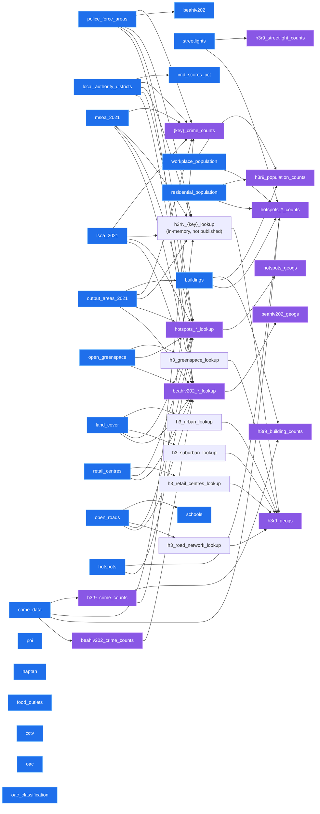

# safer-streets-tooling

Data-build tooling for the safer-streets project. Builds the production GeoParquet outputs
(crime + ONS boundaries + supplementary layers + per-cell aggregations) as modular, per-dataset
files — consumers query these directly (in-memory DuckDB, locally or from Azure Blob). Depends on
[`safer-streets-core`](../safer-streets-core) for the database
helpers, H3 transforms, the data-source catalogue, and the ONS boundary downloader.

## Pipeline

Two phases (extract → transform), driven by a dataset registry
(`safer_streets_tooling.extract.DATASETS`) and a transform-step registry
(`safer_streets_tooling.transform.STEPS`):

Every point layer the extract produces (buildings by centroid, schools, poi, naptan, food_outlets,
streetlights, cctv) carries a cell id **per grid** — `h3r9_id` and `beahiv202_id` — minted in one place
([`_common.cell_id_columns`](src/safer_streets_tooling/extract/_common.py)), so the transform can group
by a column instead of joining on geometry, and a consumer can join a feature straight to either grid's
`*_geogs`.

1. **extract** — each dataset is downloaded and preprocessed in its own in-memory DuckDB and dumped to
   a `<name>.parquet` GeoParquet file under `data_dir()/extract` (raw source files are cached under
   `data_dir()/raw`). Extractors run **concurrently** as
   nodes in an `AsyncPipeline`, respecting `depends_on` edges (e.g. `schools` waits for `open_roads`,
   `imd` for `local_authority_districts`). Each parquet is a durable per-dataset cache, so a single
   dataset can be refreshed without rebuilding everything.
2. **transform** — the extracted parquet are loaded into a throwaway in-memory DuckDB, geometry is
   indexed, and the aggregation steps (`safer_streets_tooling.transform.STEPS`) run. The BTP-filtered
   `h3r*_crime_counts` are aggregated from `crime_data` (and `{key}_crime_counts` point-in-polygon per
   ONS geography), then every derived relation (those counts, the
   per-cell lookups and `h3r{res}_geogs`) is written out as its own parquet under `data_dir()/transform`
   — a durable cache, so the aggregations can be rebuilt without re-extracting. The same relations are
   also built on the Home Office hotspot hexes (`hotspots_crime_counts`, `hotspots_geogs`, …) and on
   the BEAHIV grid; see [Spatial units](#spatial-units). `--grid` narrows a run to one or more of the
   three grid families (`h3` / `ho` / `beahiv`); by default all three are built.

The parquet **are** the deliverable: consumers query them directly (an in-memory DuckDB over the
parquet, locally or straight from the Azure blob container `data sync` maintains).

### Extract & transform DAG

In **extract**, every dataset is an `AsyncNode` keyed by its name; `depends_on` are the edges. Nodes
with no incoming edge start immediately and run concurrently (each blocking extractor in a worker
thread); a dependent only starts once its dependencies have produced their parquet. In **transform**
(`safer_streets_tooling.transform`), each step is likewise an `AsyncNode` keyed by
its name with `depends_on` edges: the BTP-filtered `h3rN_crime_counts` are aggregated from `crime_data`
(and `{key}_crime_counts` point-in-polygon against each ONS boundary table);
every H3 cell is keyed off them, then given one ONS code per geography,
the overlapping greenspace / land-cover / road features, and its nearest retail centre — all folded
into `h3rN_geogs`. (For brevity the transform nodes collapse the per-resolution `N`, currently just
`{9}`; the geography / overlap / retail lookups all draw their cell set from `h3rN_crime_counts`.)

The per-geography lookups (`h3rN_{key}_lookup` and their hotspot / BEAHIV twins) are **build
intermediates**, materialised in the transform's in-memory DuckDB and never written out: `*_geogs`
carries every code as a column over exactly the same cells, so publishing both would be the same data
twice and two places to look for a cell's LSOA. The overlap lookups *are* published, because `*_geogs`
keeps only an id list and one aggregate measure per layer — the per-feature overlap areas and the
descriptive columns (greenspace function, road type, school name) live only in the lookup.

The same relations are built a second time on the **Home Office hotspot hexes** — the `hotspots`
extract's 350m hex-grid polygons — by the `hotspot_counts` / `hotspot_lookups` / `hotspot_geogs` steps,
giving `hotspots_crime_counts`, `hotspots_*_counts`, `hotspots_*_lookup` and `hotspots_geogs`. That
family is keyed by the hex id in the same `spatial_id` column, so it joins exactly like the H3 one; its
cells come from the polygons rather than from the crime counts, so those steps depend on no other step
(and are a clean no-op when the optional `hotspots` extract is absent).

A third family is built on the **BEAHIV 202m hex grid** by the `beahiv_counts` / `beahiv_lookups` /
`beahiv_geogs` steps, giving `beahiv202_crime_counts`, `beahiv202_*_lookup` and `beahiv202_geogs`.
Like the H3 family its cells come from its own crime counts, so the chain has the H3 one's shape on the
other grid; see [Spatial units](#spatial-units) for why the grid is there at all.


```mermaid
flowchart LR
   crime_data
   police_force_areas
   local_authority_districts
   msoa_2021
   lsoa_2021
   output_areas_2021
   open_greenspace
   land_cover
   buildings
   retail_centres
   open_roads
   poi
   naptan
   food_outlets
   streetlights
   cctv
   schools
   imd_scores_pct
   oac
   oac_classification
   workplace_population
   residential_population
   beahiv202
   hotspots

   h3r9_crime_counts
   geog_crime_counts["{key}_crime_counts"]
   h3r9_streetlight_counts
   h3r9_building_counts
   h3r9_population_counts
   h3_geogs_lookup["h3rN_{key}_lookup<br/>(in-memory, not published)"]
   h3_greenspace_lookup
   h3_urban_lookup
   h3_suburban_lookup
   h3_road_network_lookup
   h3_retail_centres_lookup
   h3r9_geogs
   hotspot_counts["hotspots_*_counts"]
   hotspot_lookups["hotspots_*_lookup"]
   hotspots_geogs
   beahiv202_crime_counts
   beahiv_lookups["beahiv202_*_lookup"]
   beahiv202_geogs

   direction LR

    %% extract edges
    open_roads --> schools
    local_authority_districts --> imd_scores_pct
    output_areas_2021 --> buildings

    %% transform edges
    crime_data --> h3r9_crime_counts
    crime_data --> geog_crime_counts
    police_force_areas --> geog_crime_counts
    local_authority_districts --> geog_crime_counts
    msoa_2021 --> geog_crime_counts
    lsoa_2021 --> geog_crime_counts
    output_areas_2021 --> geog_crime_counts
    streetlights --> h3r9_streetlight_counts
    buildings --> h3r9_building_counts
    h3r9_crime_counts --> h3r9_building_counts
    buildings --> h3r9_population_counts
    workplace_population --> h3r9_population_counts
    residential_population --> h3r9_population_counts
    police_force_areas --> beahiv202
    h3r9_crime_counts --> h3_geogs_lookup
    police_force_areas --> h3_geogs_lookup
    local_authority_districts --> h3_geogs_lookup
    msoa_2021 --> h3_geogs_lookup
    lsoa_2021 --> h3_geogs_lookup
    output_areas_2021 --> h3_geogs_lookup
    open_greenspace --> h3_greenspace_lookup
    land_cover --> h3_urban_lookup
    land_cover --> h3_suburban_lookup
    open_roads --> h3_road_network_lookup
    retail_centres --> h3_retail_centres_lookup
    h3_geogs_lookup --> h3r9_geogs
    h3_greenspace_lookup --> h3r9_geogs
    h3_urban_lookup --> h3r9_geogs
    h3_suburban_lookup --> h3r9_geogs
    h3_road_network_lookup --> h3r9_geogs
    h3_retail_centres_lookup --> h3r9_geogs

    %% transform edges: the same relations on the hotspot hexes (their own grid, so no crime_counts edge)
    hotspots --> hotspot_counts
    crime_data --> hotspot_counts
    streetlights --> hotspot_counts
    buildings --> hotspot_counts
    workplace_population --> hotspot_counts
    residential_population --> hotspot_counts
    hotspots --> hotspot_lookups
    police_force_areas --> hotspot_lookups
    local_authority_districts --> hotspot_lookups
    msoa_2021 --> hotspot_lookups
    lsoa_2021 --> hotspot_lookups
    output_areas_2021 --> hotspot_lookups
    open_greenspace --> hotspot_lookups
    land_cover --> hotspot_lookups
    open_roads --> hotspot_lookups
    retail_centres --> hotspot_lookups
    hotspot_lookups --> hotspots_geogs

    %% transform edges: the same relations on the BEAHIV grid (its cells come from its own counts)
    crime_data --> beahiv202_crime_counts
    beahiv202_crime_counts --> beahiv_lookups
    police_force_areas --> beahiv_lookups
    local_authority_districts --> beahiv_lookups
    msoa_2021 --> beahiv_lookups
    lsoa_2021 --> beahiv_lookups
    output_areas_2021 --> beahiv_lookups
    open_greenspace --> beahiv_lookups
    land_cover --> beahiv_lookups
    open_roads --> beahiv_lookups
    retail_centres --> beahiv_lookups
    beahiv_lookups --> beahiv202_geogs

    %% colour by phase, tuned for dark backgrounds (white text on saturated fills, light strokes)
    classDef extract fill:#1f6feb,stroke:#79c0ff,stroke-width:1px,color:#ffffff;
    classDef transform fill:#8957e5,stroke:#d2a8ff,stroke-width:1px,color:#ffffff;
    class crime_data,police_force_areas,local_authority_districts,msoa_2021,lsoa_2021,output_areas_2021,open_greenspace,land_cover,buildings,retail_centres,open_roads,poi,naptan,food_outlets,streetlights,cctv,schools,imd_scores_pct,oac,oac_classification,workplace_population,residential_population,beahiv202,hotspots extract;
    class h3r9_crime_counts,geog_crime_counts,h3r9_streetlight_counts,h3r9_building_counts,h3r9_population_counts,h3r9_geogs,hotspot_counts,hotspot_lookups,hotspots_geogs,beahiv202_crime_counts,beahiv_lookups,beahiv202_geogs transform;
```

Each extract node writes `<name>.parquet`; the **transform** phase turns those into the per-cell
aggregation parquet, one per relation. Those parquet are the build's output — a consumer joins the
counts to the `*_geogs` on `spatial_id` and the ONS boundary tables by code. The `streetlight_counts`
transform step aggregates the `streetlights` extract into a per-cell `h3r9_streetlight_counts` (count of
street lights per resolution-9 cell, keyed by `spatial_id`).

The `buildings` extract itself spatially joins each footprint to the 2021 output areas, tagging it with
`oa21cd` (the OA21 code) of the OA containing its **centroid** (a LEFT join, so a footprint whose
centroid falls outside every OA — e.g. Scotland or offshore structures — is kept with a null
`oa21cd` rather than dropped). The same centroid is also indexed to a cell on **each grid** —
`h3r9_id` (lowercase hex) and `beahiv202_id` (the encoded cell id) — so the raw layer joins
straight onto either crime grid, `h3r9_geogs` or `beahiv202_geogs`. Alongside
the premise/use classification each footprint carries its size: `premise_floor_count` (number of floors;
kept verbatim as text since a premise whose floor count varies across its footprint carries a comma-list,
e.g. `"1,2"`), `premise_area` (footprint area, m²) and `gross_area` (total floor area, m² — footprint ×
floors where known).

Likewise the `building_counts` transform step aggregates the `buildings` extract (Verisk UKBuildings
footprints) into `h3r9_building_counts` — the count of buildings per resolution-9 cell **split by
`map_simple_use`** (Residential / Non Residential / Mixed Use), keyed by `spatial_id`. Each building is
placed by its footprint centroid, and the output is restricted to cells present in `h3r9_crime_counts`
so it lines up with the crime grid (≈83% of all footprints fall in a crime cell). The per-cell counts
are the useful form for a consumer; the raw `buildings` layer is tens of millions of polygons.

Two attribute-only extracts hold the Census 2021 populations per 2021 output area, both keyed by
`spatial_id` (the OA21 code). `workplace_population` is the **WP001** count (nomis bulk download): the
workplace population is an estimate of the usually resident population aged 16 years and over, working
in an area. It includes people who work mainly at or from home, or do not have a fixed place of work,
in their area of usual residence. `residential_population` is the **TS001** count of usual residents
(nomis API, table `NM_2021_1`; needs a free `NOMIS_API_KEY`), split by residence type into
`household_population` and `communal_population`. A usual resident is anyone who, on Census Day
(21 March 2021), was in the UK and had stayed or intended to stay in the UK for a period of 12 months
or more, or had a permanent UK address and was outside the UK and intended to be outside the UK for
less than 12 months.

The `population_counts` transform step disaggregates both onto the crime grid as
`h3r9_population_counts` (one row per res-9 cell: `spatial_id`, `residential_population`,
`workplace_population`). Each OA's populations are first assigned to that OA's buildings pro rata to
total floor area (`gross_area`, falling back to the footprint `premise_area` where the floor count is
unknown) times a use weight — the workplace population to **Non Residential** (×1.0) and **Mixed Use**
(×0.5) buildings, the residential population (households + communal establishments) to **Residential**
(×1.0) and **Mixed Use** (×0.5), i.e. a mixed-use building sits 50-50 in both pools — then the
per-building assignments are grouped by the building's `h3r9_id` and summed. Both populations are
conserved onto the grid except where they cannot be assigned (an OA with no building of the right
type, or a building whose centroid falls in no OA); the step reports the allocated share of each
source total. It is bundled in the default minimal DB (skipped if any of its three input extracts was
absent).

> **TODO:** now that the `buildings` extract carries `h3r9_id` per footprint, `h3r9_building_counts` may
> be surplus to requirements — a consumer can aggregate the counts directly from `buildings` by
> `h3r9_id` / `map_simple_use`. Consider dropping the transform (and its bundled table) once nothing
> depends on the pre-aggregated form.

OSM coverage of the `streetlights` and `cctv` layers is uneven — see
[Data-quality caveats](#data-quality-caveats) below.

Geometry is British National Grid (EPSG:27700) by convention; the DuckDB GeoParquet writer tags it
`OGC:CRS84`, which is stripped to a bare `GEOMETRY` when the transform imports it (the coordinates are
the contract).

## Datasets

One module per dataset under [src/safer_streets_tooling/extract/](src/safer_streets_tooling/extract/),
each exposing a `DATASET` (or `DATASETS` for the boundary group). Required datasets abort the build if
they can't be produced; optional ones are best-effort and skipped (the H3 transforms tolerate their
absence). Registry order respects `depends_on`:

| Dataset(s) | Module | Required? | Depends on |
| ---------- | ------ | --------- | ---------- |
| `crime_data` | [crime.py](src/safer_streets_tooling/extract/crime.py) | yes | — |
| 5 ONS boundary tables | [boundaries.py](src/safer_streets_tooling/extract/boundaries.py) | yes | — |
| `open_greenspace` | [greenspace.py](src/safer_streets_tooling/extract/greenspace.py) | no | — |
| `land_cover` | [land_cover.py](src/safer_streets_tooling/extract/land_cover.py) | no | — |
| `buildings` | [buildings.py](src/safer_streets_tooling/extract/buildings.py) | no | `output_areas_2021` (OA `oa21cd` for each footprint) |
| `retail_centres` | [retail_centres.py](src/safer_streets_tooling/extract/retail_centres.py) | no | — |
| `open_roads` | [roads.py](src/safer_streets_tooling/extract/roads.py) | no | — |
| `poi` | [poi.py](src/safer_streets_tooling/extract/poi.py) | no | — |
| `naptan` | [naptan.py](src/safer_streets_tooling/extract/naptan.py) | no | — |
| `food_outlets` | [food_outlets.py](src/safer_streets_tooling/extract/food_outlets.py) | no | — |
| `streetlights` | [streetlights.py](src/safer_streets_tooling/extract/streetlights.py) | no | — |
| `cctv` | [cctv.py](src/safer_streets_tooling/extract/cctv.py) | no | — |
| `schools` | [schools.py](src/safer_streets_tooling/extract/schools.py) | no | `open_roads` (walk-isochrone network) |
| `imd_scores_pct` | [imd.py](src/safer_streets_tooling/extract/imd.py) | no | `local_authority_districts` (Welsh LA-name→code lookup) |
| `oac`, `oac_classification` | [oac.py](src/safer_streets_tooling/extract/oac.py) | no | — |
| `workplace_population` | [workplace_population.py](src/safer_streets_tooling/extract/workplace_population.py) | no | — |
| `residential_population` | [residential_population.py](src/safer_streets_tooling/extract/residential_population.py) | no | — |
| `beahiv202` | [beahiv202.py](src/safer_streets_tooling/extract/beahiv202.py) | no | `police_force_areas` (the grid is derived from the force boundaries) |
| `hotspots` | [hotspots.py](src/safer_streets_tooling/extract/hotspots.py) | no | — |

## Data-quality caveats

### OSM coverage: `streetlights` & `cctv`

Both layers are sourced from OpenStreetMap and inherit its uneven, volunteer-driven coverage:

- **`streetlights`** — Overture Maps `base/infrastructure`, `subtype = transportation` /
  `class = street_lamp` (OSM `highway=street_lamp`), streamed from S3.
- **`cctv`** — OSM `man_made=surveillance` nodes, via the Overpass API.

OSM tagging of street furniture is **comprehensive in some areas and sparse or entirely absent in
others** — coverage tends to arrive via occasional bulk imports (a council's asset inventory, a local
mapping party) rather than organic, nationwide surveying. So `streetlights`, `cctv` and the derived
`h3r9_streetlight_counts` are best read as a **presence / indicative** signal, **not** a complete or
authoritative inventory.

Concretely, the England & Wales `streetlights` extract holds ~129k lamps spread across only ~13.7k
distinct resolution-9 cells (out of ~1.4M land cells), heavily clustered in a handful of well-mapped
areas. Most cells report zero not because they are unlit but because nobody has tagged their lighting.
This was checked against the raw Overture release — the extract row count matches Overture exactly, and
the BNG reprojection and H3-cell assignment are both correct — so the sparsity is a **source-data
limitation, not a pipeline bug**.

**Authoritative alternative (OS).** For a complete national inventory the authoritative source is
Ordnance Survey — the OS NGD street-lighting collection (`trn-fts-streetlight-1`, Transport theme /
street furniture), which requires a keyed OS Data Hub / NGD API subscription. We should switch
`streetlights` over to the OS dataset **once (a) it can be located and accessed under our OS licence
and (b) that licence permits us to publish the aggregate `h3r9_streetlight_counts` we derive from it**
(per-cell counts, not the raw point locations). Until then the OSM/Overture layer stands as an
indicative placeholder. The same OS caveat applies to `cctv`, for which there is no comparable
authoritative national feed — it remains indicative only.

## Transform steps

One module per step under [src/safer_streets_tooling/transform/](src/safer_streets_tooling/transform/),
each exposing a `STEP`. Each step writes the relations it produces out as parquet under
`data_dir()/transform`; a step whose outputs already exist is skipped unless `--all`. Registry order
respects `depends_on`:

| Step | Module | `--grid` | Outputs | Depends on |
| ---- | ------ | -------- | ------- | ---------- |
| `crime_counts` | [crime_counts.py](src/safer_streets_tooling/transform/crime_counts.py) | `h3` | `h3r{res}_crime_counts`, `{key}_crime_counts` (per ONS geography) | — |
| `streetlight_counts` | [streetlight_counts.py](src/safer_streets_tooling/transform/streetlight_counts.py) | `h3` | `h3r9_streetlight_counts` | — |
| `building_counts` | [building_counts.py](src/safer_streets_tooling/transform/building_counts.py) | `h3` | `h3r9_building_counts` (by `map_simple_use`) | `crime_counts` |
| `population_counts` | [population_counts.py](src/safer_streets_tooling/transform/population_counts.py) | `h3` | `h3r9_population_counts` | — |
| `road_intersection_counts` | [road_intersection_counts.py](src/safer_streets_tooling/transform/road_intersection_counts.py) | `h3` | `h3r{res}_road_intersection_counts` | `crime_counts` |
| `geo_lookups` | [geo_lookups.py](src/safer_streets_tooling/transform/geo_lookups.py) | `h3` | *(none — `h3r{res}_{key}_lookup` stays in memory, folded into `h3r{res}_geogs`)* | `crime_counts` |
| `overlap_lookups` | [overlap_lookups.py](src/safer_streets_tooling/transform/overlap_lookups.py) | `h3` | `h3r{res}_{name}_lookup` | `crime_counts` |
| `retail_centre_lookups` | [retail_centre_lookups.py](src/safer_streets_tooling/transform/retail_centre_lookups.py) | `h3` | `h3r{res}_retail_centre_lookup` | `crime_counts` |
| `geogs` | [geogs.py](src/safer_streets_tooling/transform/geogs.py) | `h3` | `h3r{res}_geogs` | `crime_counts`, `geo_lookups`, `overlap_lookups`, `retail_centre_lookups` |
| `hotspot_counts` | [hotspot_counts.py](src/safer_streets_tooling/transform/hotspot_counts.py) | `ho` | `hotspots_crime_counts`, `hotspots_{streetlight,building,population,road_intersection}_counts` | — |
| `hotspot_lookups` | [hotspot_lookups.py](src/safer_streets_tooling/transform/hotspot_lookups.py) | `ho` | `hotspots_{name}_lookup`, `hotspots_retail_centre_lookup` (the `hotspots_{key}_lookup` stay in memory) | — |
| `hotspot_geogs` | [hotspot_geogs.py](src/safer_streets_tooling/transform/hotspot_geogs.py) | `ho` | `hotspots_geogs` | `hotspot_lookups` |
| `beahiv_counts` | [beahiv_counts.py](src/safer_streets_tooling/transform/beahiv_counts.py) | `beahiv` | `beahiv202_crime_counts` | — |
| `beahiv_lookups` | [beahiv_lookups.py](src/safer_streets_tooling/transform/beahiv_lookups.py) | `beahiv` | `beahiv202_{name}_lookup`, `beahiv202_retail_centre_lookup` (the `beahiv202_{key}_lookup` stay in memory) | `beahiv_counts` |
| `beahiv_geogs` | [beahiv_geogs.py](src/safer_streets_tooling/transform/beahiv_geogs.py) | `beahiv` | `beahiv202_geogs` | `beahiv_counts`, `beahiv_lookups` |

### Spatial units

The transform aggregates onto three grids, all keyed by `spatial_id`. Each is a `Grid` family — the
values of `data transform --grid`, repeatable, all three by default:

| Unit | `--grid` | `key` | Cells | Cell area | `spatial_id` |
| ---- | -------- | ----- | ----- | --------- | ------------ |
| H3, per resolution in `H3_RESOLUTIONS` (currently `[9]`) | `h3` | `h3r{res}` | the cells carrying crimes, from `h3r{res}_crime_counts` | `h3_cell_area` (geodesic, m²) | the cell's canonical hex string (`VARCHAR`) |
| Home Office hotspot hexes | `ho` | `hotspots` | every polygon in the `hotspots` extract | `ST_Area` of the polygon (m²) | the supplied hex id (`VARCHAR`) |
| [BEAHIV](https://github.com/safer-streets/beahiv) 202m equal-area hexes | `beahiv` | `beahiv202` | the cells carrying crimes, from `beahiv202_crime_counts` | `3√3/2·s²` — a constant, the grid being equal-area (planar m²) | the encoded cell id (`BIGINT`) |

A [`SpatialUnit`](src/safer_streets_tooling/transform/base.py) holds what the per-cell SQL varies on
(the `key` that names its relations, the subquery yielding each cell's `spatial_id` + BNG `cell_geom`,
and its area expression), so `geo_lookups` / `overlap_lookups` / `retail_centre_lookups` / `geogs` each
have one `build_unit` that all three step families call. The counts differ more — placing a *point* in
an H3 cell is an id lookup, in a hotspot hex a point-in-polygon join, in a BEAHIV cell arithmetic on
its BNG coordinates — so each counts module carries a `build_hotspots` alongside its H3 `build`
(`hotspot_counts` wires them together), and `beahiv_counts` is its own step.

Every step declares its family in the `grid` field of its `TransformStep`, and no step depends on one
in another family (checked at import), so `--grid` can build any subset: the unselected steps are left
out of the pipeline entirely and their parquet on disk are untouched. The H3 resolutions are not a CLI
knob — they are a property of the H3 gridding, taken from `H3_RESOLUTIONS`.

#### Why BEAHIV as well as H3

A 202 m side gives a cell of ~0.106 km², within a percent of an H3 resolution-9 cell, so
`beahiv202_geogs` and `h3r9_geogs` are the same attributes over comparable cells on identical data —
which is the point: it makes the two griddings comparable rather than replacing one with the other.
BEAHIV is natively EPSG:27700 and exactly equal-area there, where H3 cells vary in area and are
reprojected from WGS-84. `beahiv202_geogs` carries the same columns in the same order as
`h3r9_geogs`; only `spatial_id`'s type differs, since the two indexings identify a cell differently.

The BEAHIV grid parameters live once in
[beahiv_grid.py](src/safer_streets_tooling/beahiv_grid.py) — the extract that tiles England & Wales and
the transform that counts onto it must agree on the side length and orientation, or they produce two
disjoint grids that still join without error.

`spatial_id` is a plain `BIGINT`: beahiv reserves the top three bits of a cell id, so every one of them
fits a signed 64-bit column and `int(spatial_id)` is what beahiv's `decode` takes. DuckDB has no
function that decodes one, so the cell geometry comes from a vectorised (`type="arrow"`) UDF over
beahiv's `centroid` plus constant vertex offsets — every cell of a given side length and orientation is
the same hexagon translated. Counting uses the matching encoder, `bng_to_cell`, rather than
`latlon_to_cell`: the crime points are already BNG, and pyproj called from DuckDB's worker threads
segfaults the process.

## Table catalogue (`index.parquet`)

Every command that (re)builds parquet (`extract` / `transform` / `build`) rewrites
`data_dir()/index.parquet` (also available standalone as `data index`): one row per parquet
under `extract/` and `transform/`, with its `phase`, `name`, a one-line `description`, its
`n_rows` / `n_columns` / `columns` schema summary, a `has_geometry` flag, a `local_only` flag and
`last_modified` — the
parquet's mtime (UTC), i.e. when the table was last built (`sync` preserves it across machines). The
descriptions come from
the registries — `Dataset.description` (extract) and `TransformStep.description` (transform) — which are
**required** (validated at import), so every shareable table in the catalogue is described. Keep those
fields current when a table changes and the catalogue follows.

`local_only` is `is_local_only(name)` — the same predicate `sync` filters on, so the flag cannot drift
from what actually reaches the container. The catalogue covers every table that was built and the flag
says which of them exist on this machine only, so a consumer reading the index from the blob container
can tell a table it will not find there from one that was never built (see
[What never syncs](#what-never-syncs)). A flagged row's `description` is left **blank**: the catalogue
travels and the description is the one field that says what the table *is*, so the row records only
that the table exists and is not in the container.

## Key modules

Source lives in [src/safer_streets_tooling/](src/safer_streets_tooling/):

| File | Role |
| ---- | ---- |
| [data_pipeline.py](src/safer_streets_tooling/data_pipeline.py) | `data` CLI: `extract` / `transform` / `build` / `index` / `sync` commands |
| [index.py](src/safer_streets_tooling/index.py) | `build_index`: writes `index.parquet` cataloguing every extract + transform table (name, description, schema) |
| [local_only.py](src/safer_streets_tooling/local_only.py) | `is_local_only`: which tables stay local — the hotspot family, excluded from `sync` and flagged in `index.parquet` |
| [extract/pipeline.py](src/safer_streets_tooling/extract/pipeline.py) | Concurrent extract phase: `DatasetExtractNode`, `build_pipeline`, `run_extract` |
| [transform/pipeline.py](src/safer_streets_tooling/transform/pipeline.py) | Concurrent transform phase: `TransformNode`, `build_pipeline`, `build_all` |
| [async_pipeline.py](src/safer_streets_tooling/async_pipeline.py) | DAG runner over `AsyncNode`s (`graphlib.TopologicalSorter` + `asyncio.gather`) |
| [async_node.py](src/safer_streets_tooling/async_node.py) | `AsyncNode` base: derives `dependency_ids` from `execute`'s kwonly args; `__call__` captures exceptions as `Err` |
| [result.py](src/safer_streets_tooling/result.py) | `Result[T]` / `Ok` / `Err` (`unwrap`, `is_ok`, `is_err`) |
| [extract/base.py](src/safer_streets_tooling/extract/base.py) | `Dataset` spec + `ExtractContext` |
| [extract/__init__.py](src/safer_streets_tooling/extract/__init__.py) | Ordered `DATASETS` registry + `BY_NAME` + dependency validation |
| [extract/_common.py](src/safer_streets_tooling/extract/_common.py) | `download`, `extract_cached`, `rename_geom_column`, `write_geoparquet`, `read_geoparquet` |
| [transform/base.py](src/safer_streets_tooling/transform/base.py) | `TransformStep` + `SpatialUnit` + `Grid` specs, `H3_RESOLUTIONS` / `h3_unit`, `create_clause` / `table_exists` helpers |
| [transform/hotspots.py](src/safer_streets_tooling/transform/hotspots.py) | The hotspot-hex unit: `HOTSPOT_UNIT`, `available`, `placed_points` (point-in-hex join) |
| [transform/beahiv.py](src/safer_streets_tooling/transform/beahiv.py) | The BEAHIV unit: `BEAHIV_UNIT`, `available`, `register_udfs` (cell encode + centre decode) |
| [beahiv_grid.py](src/safer_streets_tooling/beahiv_grid.py) | The BEAHIV grid's side length / orientation / key / cell area, shared by the extract and the transform |
| [transform/__init__.py](src/safer_streets_tooling/transform/__init__.py) | Ordered `STEPS` registry + `BY_NAME` + dependency validation |

## Usage

```bash
uv sync
uv run data build                       # extract any missing parquet, then transform
uv run data extract                     # (re)build only missing parquet intermediates
uv run data extract --only schools      # refresh one dataset (reads open_roads.parquet from cache)
uv run data extract --force-download    # re-fetch every source and rebuild
uv run data transform                   # (re)build every grid's aggregation parquet from the extract parquet
uv run data transform --grid beahiv     # …only the BEAHIV grid (repeatable: --grid h3 --grid ho --grid beahiv)
uv run data index                       # (re)write index.parquet by hand (extract/transform/build do this too)
uv run data sync                        # upload the extract + transform parquet to Azure Blob (phase2)
uv run data sync --update newer         # two-way: upload if local newer, download if remote newer
```

To get started quickly, just sync your `SAFER_STREETS_DATA_DIR` with the cloud (credentials needed):

```sh
uv run data sync --update newer         # two-way: upload if local newer, download if remote newer
```

and query the parquet directly with an in-memory DuckDB (locally, or straight from the blob container
without syncing at all) — the consumer workflow.

`data sync` reconciles every `*.parquet` under `data_dir()/extract` and `data_dir()/transform` — plus
the root `index.parquet` catalogue — with the
`phase2` container, keyed by path relative to `data_dir()` (e.g. `extract/crime_data.parquet`). The
account URL comes from the `SAFER_STREETS_BLOB_STORAGE` env var and authentication uses a service
principal (`AZURE_*` credentials); see `safer_streets_core.file_storage`. A blob absent remotely is
always uploaded; for one that exists on both sides `--update` decides:

- `ignore` *(default)* — upload-only; skip blobs that already exist
- `newer` — **two-way**: upload if the local file is newer, download if the remote blob is newer (and
  pull down blobs that exist only remotely). After each transfer the local mtime is aligned to the
  remote's so repeated runs don't ping-pong.
- `different` — upload-only; overwrite if the md5 sums differ
- `force` — upload-only; always overwrite

### What never syncs

The Home Office hotspot hexes are supplied in confidence, so neither they nor anything derived from
them may reach the shared container. [local_only.py](src/safer_streets_tooling/local_only.py) holds that
rule as a set of spatial-unit keys (currently just `hotspots`) and matches any table named after one —
the bare key (`hotspots`), the `hotspots_*` prefix (`hotspots_geogs`, `hotspots_lad24cd_lookup`, …) and
the `*_hotspots` suffix (`hotspots_crime_counts`, `hotspots_building_counts`, …). Because the whole
family is named off the unit key, a hotspot step added later is excluded without editing anything.

The exclusion applies under **every** `--update` policy and in **both** directions: a matching local
parquet is never uploaded, and a matching blob is never downloaded (so a copy from before this rule
existed cannot be pulled back onto a machine, nor re-uploaded from there). Each run prints what it held
back. `index.parquet` still catalogues these tables, marked `local_only` and with a blank `description`
— the catalogue does travel, so their names, row counts and column names do reach the container even
though no row data and no description ever does.

`sync` never deletes, so blobs uploaded before the exclusion existed are still in the container; a run
lists any it finds under a `local-only blob(s) already in phase2` warning, to be removed by hand.

## Adding a dataset

1. Write a module under `src/safer_streets_tooling/extract/` exposing a `DATASET = Dataset(...)`
   whose `extract(ctx)` writes `ctx.parquet(name)` (use `_common.write_geoparquet`). Give it a one-line
   `description` (required — surfaced in `index.parquet`).
2. Register it in `src/safer_streets_tooling/extract/__init__.py` (after any `depends_on`).
3. `data extract --only <name>` then `data transform` (and `data sync` to publish).

## Adding a transform step

1. Write a module under `src/safer_streets_tooling/transform/` exposing a `STEP = TransformStep(...)`
   with a `build(con, replace)`, an `outputs(con)` listing the relations it produces, the `grid` family
   it belongs to (`Grid.H3` / `Grid.HO` / `Grid.BEAHIV`), a one-line `description` (required — surfaced
   in `index.parquet`), and the names of any steps it `depends_on` — which must be in the same family,
   or a `--grid` subset would drop them (checked at import).
2. Register it in `src/safer_streets_tooling/transform/__init__.py` (after any `depends_on`).
3. `data transform` (or `data transform --grid <family>`) then `data sync`.
